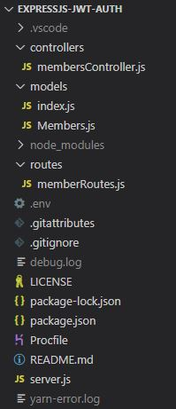

# expressjs-jwt-auth
Express.js & MongoDB REST API for handling authentication ( registration , login )  with  JSON Web Tokens
  
 **Project Structure**

 
  
 **Technology**
-   Express 
-   mongoose 
-   bcryptjs 
-   jsonwebtoken 

  **RESTful URIs and methods**
 
| Method| URI| Function |
| ------ | ------ |  ------ |
| GET| / | Test implementation |
| GET| /api/member/fetchMember| Verify token and retrieve account |
| POST| /api/member/register | Register new account|
| POST| /api/member/login| Login an account|

 
 
